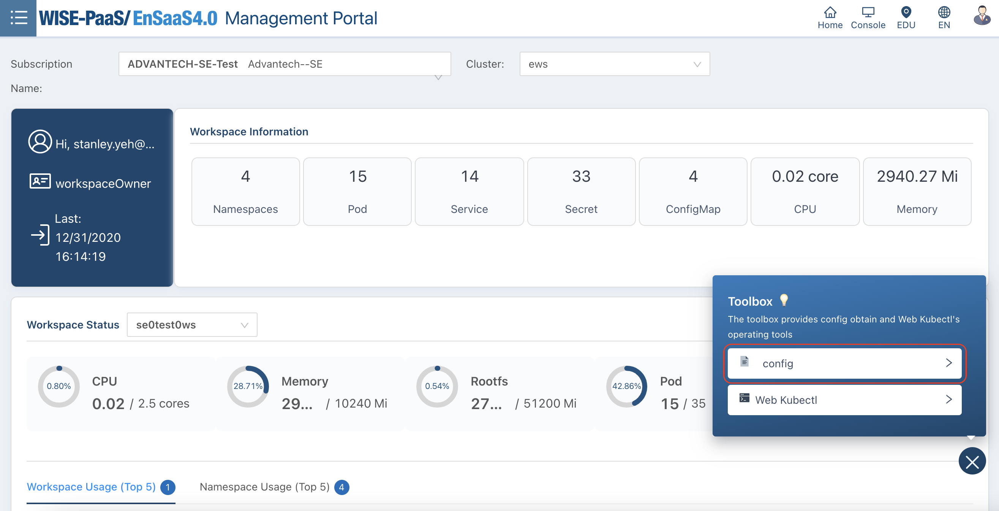
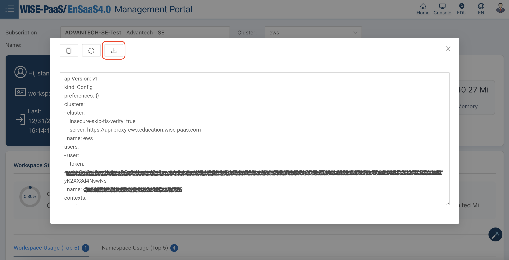
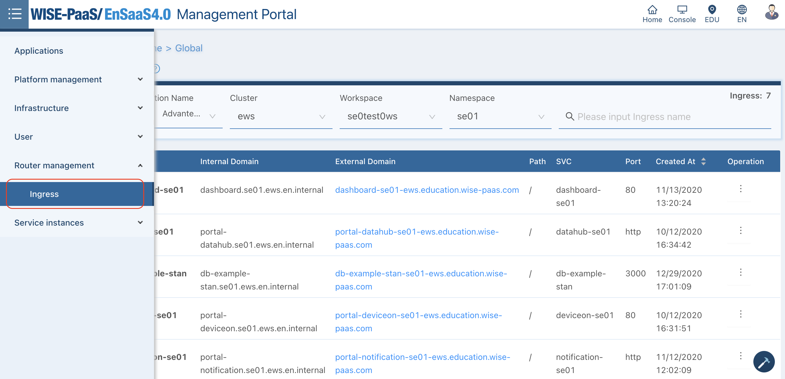

# example-db-connection

Examples of short code snippets to connect to various WISE-PaaS DB services. This app can be deployed to an EnSaaS namespace to demonstrate how to use secrets to make connection to WISE-PaaS' database services.

## Prerequisites

In order to follow the steps described in this readme, you will need to have the following applications installed in your environment:

- Git
- Docker
- kubectl

You will also need a WISE-PaaS account that can access an EnSaaS namespace to deploy this demo app, and access to an image registry (i.e. Docker Hub).

Users can log on WISE-PaaS Management Portal to download Kubernetes config for kubectl from the bottom-right icon:



View or download config file:



## Build and Deploy Demo App Docker Image

1. Clone this project into your development environment:

    ```bash
    #!/bin/bash
    $ git clone https://github.com/WISE-PaaS/example-db-connection.git
    ```

2. Build Docker image and upload to a image registry (i.e. Docker Hub)

    ```bash
    #!/bin/bash
    $ cd example-db-connection
    $ docker build -t {yourRepository}/{imageName}:{tag} .
    ...
    $ docker push {yourRepository}/{image}:{tag}
    ```

    > Please note, you will need access to an image registry such as Docker Hub, and use your own account to build and push the demo app image.

3. Deploy the demo app to WISE-PaaS

    First, replace the values with {{...}} brackets in the YAML files in the k8s folder to match your actual environment.

    Before making the deployment, we verify that the context of kubectl is referring to an EnSaaS resource space with:

    ```bash
    #!/bin/bash
    $ kubectl config current-context
    cfe41671-17fe-11eb-8cb1-0a580ae94739-ews
    ```

    EnSaaS context name has the format `{uuid}-ews` or `{uuid}-eks###`.

    After the verification, execute the apply command from the root directory of the project:

    ```bash
    #!/bin/bash
    $ kubectl apply -f k8s/
    ```

    This will create the Kubernetes objects represented by the YAML files in your EnSaaS namespace. We can check for the deployment status with the `kubectl get pods` command. When the status of the pod created by our deployment becomes `Running`, we can access the app with the URL listed in the __Ingress__ page of the __EnSaaS Management Portal__.

    

## Using the Demo App

The main program provides different HTTP request endpoints to test the connections with different WISE-PaaS DB services:

```GET /testmongo```

Attempts to make a connection to the MongoDB instance with the credentials from the supplied secret in the Kubernetes deployment configuration file. Upon successful connection, the request will return information on the database using the 'dbStats' MongoDB command.

i.e. <https://db-example-stan-se01-ews.education.wise-paas.com/testmongo>

```GET /testinflux```

Attempts to make a connection to the InfluxDB instance with the credentials from the supplied secret in the Kubernetes deployment configuration file. Upon successful connection, the request will return a list of authorized databases for the given credential.
